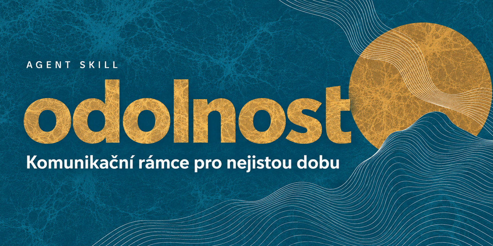

# Odolnost



Český agent skill pro navrhování, hodnocení a přizpůsobování veřejné komunikace o odolnosti, klimatu, energetice, krajině, připravenosti a společenské důvěře.

Skill převádí rámce z knihy *Odolnost: Komunikační průvodce do nejisté doby* od Jana Krajhanzla do praktického pracovního systému. Pomáhá vybrat vhodný příběh, publikum, argumenty, emoce, mluvčí, komunikační příležitost i odpověď na námitky.

## Co skill umí

- navrhnout komunikační strategii pro konkrétní publikum;
- propojit fakta a argumenty s emocemi a každodenní zkušeností pomocí rámce LOGIC & MAGIC;
- vystavět příběh odolnosti pro stát, obec, firmu nebo domácnost;
- přizpůsobit stejné jádro sdělení různým cílovým skupinám;
- využít aktuální událost pomocí aktualizačního kvarteta;
- připravit věcnou odpověď na námitku nebo dezinformaci;
- vybrat důvěryhodné mluvčí a vhodné kanály;
- odhalit komunikační chyby před publikováním;
- dohledat rámce a pojmy v jednotlivých kapitolách knihy.

## Jak funguje

Po aktivaci se nejprve načte hlavní soubor `SKILL.md` se základními pravidly, pracovní metodou a tematickým indexem. Podle konkrétního zadání si agent následně otevře jen potřebné kapitoly nebo podpůrné materiály.

Základní pracovní postup:

1. porozumět situaci a obavám publika;
2. určit, co chce publikum chránit;
3. vybrat vhodné vstupní dveře k tématu;
4. vytvořit příběh odolnosti;
5. spojit LOGIC a MAGIC;
6. vysvětlit, proč je téma důležité právě teď;
7. nabídnout proveditelný další krok;
8. otestovat sdělení mimo vlastní sociální bublinu.

## Struktura

```text
odolnost/
├── SKILL.md          hlavní instrukce, rámce a tematický index
├── cheatsheet.md     rychlá rozhodovací pravidla
├── patterns.md       praktické komunikační postupy
├── glossary.md       slovník klíčových pojmů
├── assets/           repo karta a další vizuální podklady
└── chapters/         14 tematických kapitol načítaných podle potřeby
```

## Příklady použití

```text
Použij skill odolnost a připrav komunikační strategii pro obec,
která potřebuje vysvětlit investice do stromů a hospodaření s vodou.
```

```text
Pomocí skillu odolnost uprav tento text pro nízkopříjmové domácnosti.
Zachovej fakta, ale nahraď technokratický jazyk srozumitelným příběhem.
```

```text
Použij skill odolnost a připrav věcnou odpověď na námitku,
že si Česko musí vybrat mezi obranou a klimatickými opatřeními.
```

```text
Zkontroluj tento návrh kampaně podle LOGIC & MAGIC,
aktualizačního kvarteta a seznamu komunikačních anti-vzorců.
```

## Instalace

### Codex

V Codexu spusťte `$skill-installer` a požádejte o instalaci skillu z URL tohoto repozitáře.

Skill lze nainstalovat také ručně zkopírováním celého repozitáře do osobní složky:

```text
~/.agents/skills/odolnost/
```

Po instalaci otevřete nový chat. Pokud se skill neobjeví, restartujte Codex.

### Agent Skills CLI

Po nahrazení `OWNER` vlastním uživatelským jménem:

```bash
npx skills add https://github.com/OWNER/odolnost-skill --skill odolnost
```

## Obsah skillu

- **14 kapitol** od práce s nejistotou přes segmentaci publika až po testování komunikace;
- **slovník** klíčových pojmů;
- **katalog postupů** pro tvorbu a kontrolu sdělení;
- **rozhodovací tahák** pro rychlou práci;
- **tematický index**, který směruje agenta k relevantním kapitolám.

## Zdroj a rozsah

Skill je syntézou komunikačních rámců z knihy *Odolnost: Komunikační průvodce do nejisté doby* od Jana Krajhanzla, vydané Institutem 2050 v roce 2026. Neobsahuje plný text knihy a nenahrazuje původní publikaci.

Číselné údaje a příklady odpovídají vydání z roku 2026. Před veřejným použitím je potřeba ověřit je z aktuálních primárních zdrojů. Skill není právní, vědecký ani politický fact-check.

## Autorská práva a sdílení

Obsah skillu je odvozený od publikace třetí strany. Před zveřejněním repozitáře ověřte, že máte souhlas autora nebo vydavatele, případně že licence publikace veřejné šíření takto odvozeného obsahu dovoluje. Bez takového oprávnění používejte soukromý repozitář a sdílejte ho pouze s oprávněnými spolupracovníky.

Skill byl vytvořen pomocí projektu [book-to-skill](https://github.com/virgiliojr94/book-to-skill).
